# Day 8 - DAG and Spark Execution

## Objective

The objective of Day 8 is to understand how Apache Spark executes applications using **DAGs, Jobs, Stages, Tasks, Partitions, and Shuffle Boundaries**.

This assignment demonstrates:

* Multiple transformations and actions
* Narrow and wide transformations
* Shuffle boundaries
* RDD lineage
* Stage prediction
* Jobs, stages, tasks, and partitions
* DAG Scheduler
* Parallel processing
* `toDebugString`
* Fault tolerance using RDD lineage

---

## Technologies Used

* Scala 2.12.18
* Apache Spark 3.5.3
* sbt 1.12.11
* Spark Core
* IntelliJ IDEA / VS Code
* Linux / Ubuntu

---

## Project Structure

```text
day8-spark/
├── build.sbt
├── project/
│   └── build.properties
├── src/
│   └── main/
│       └── scala/
│           └── Day8DAGExecution.scala
└── README.md
```

---

# 1. Job With Multiple Transformations and Actions

The application creates an RDD containing numbers from **1 to 20 using 4 partitions**.

The following transformations are applied:

1. `map` - multiplies each number by 2
2. `filter` - keeps values greater than 20
3. `map` - converts values into key-value pairs
4. `reduceByKey` - adds values having the same key

The application uses actions such as `collect()` to display the results.

### Execution Flow

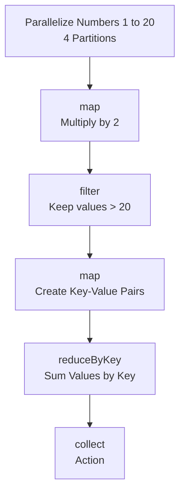

### Important Concept

Transformations are **lazy**. They build the execution plan but do not immediately execute the computation.

Actions trigger the execution of a Spark job.

### Result

**Original Numbers:**

```text
1, 2, 3, 4, 5, 6, 7, 8, 9, 10,
11, 12, 13, 14, 15, 16, 17, 18, 19, 20
```

**After MAP:**

```text
2, 4, 6, 8, 10, 12, 14, 16, 18, 20,
22, 24, 26, 28, 30, 32, 34, 36, 38, 40
```

**After FILTER:**

```text
22, 24, 26, 28, 30, 32, 34, 36, 38, 40
```

**After MAP to Key-Value:**

```text
(2,22), (0,24), (2,26), (0,28), (2,30),
(0,32), (2,34), (0,36), (2,38), (0,40)
```

**After REDUCEBYKEY:**

```text
(0,160)
(2,150)
```

---

# 2. Narrow and Wide Transformations

## Narrow Transformations

A narrow transformation is a transformation where each output partition depends on a small number of input partitions.

Examples:

* `map`
* `filter`
* `flatMap`
* `mapPartitions`

Narrow transformations do not require data to be shuffled across partitions.

## Wide Transformations

A wide transformation requires data to be redistributed across partitions.

Examples:

* `reduceByKey`
* `groupByKey`
* `distinct`
* `join`
* `repartition`

Wide transformations generally involve a **shuffle**.

### Narrow vs Wide Flow

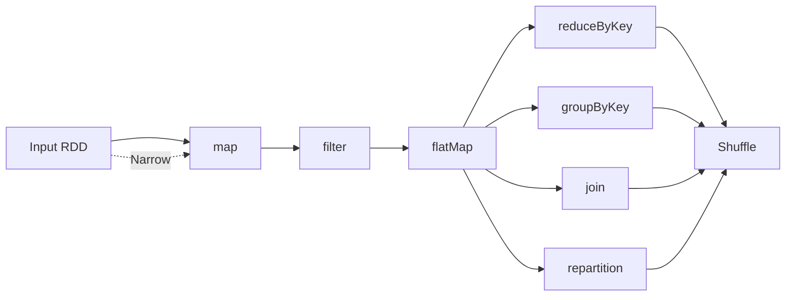

---

# 3. Shuffle Boundary

The main pipeline used in this assignment is:

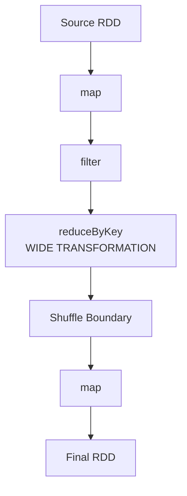

The **shuffle occurs at `reduceByKey`**.

The `map` and `filter` operations before `reduceByKey` are narrow transformations.

`reduceByKey` is a wide transformation and creates a shuffle boundary.

The `map` after `reduceByKey` belongs to the next stage.

### Why Does Shuffle Happen?

`reduceByKey` groups values having the same key.

To bring values with the same key together, Spark may need to transfer data between partitions.

This redistribution of data is called a **shuffle**.

---

# 4. Jobs, Stages, Tasks and Partitions

## Job

A Spark job is created when an action such as:

* `count()`
* `collect()`
* `reduce()`
* `save()`

is called.

## Stage

A stage is a group of tasks that can be executed together without crossing a shuffle boundary.

Shuffle boundaries divide the execution into stages.

## Task

A task is the smallest unit of work sent to an executor.

Usually, one task processes one partition.

## Partition

A partition is a logical chunk of an RDD.

Partitions allow Spark to process data in parallel.

### Relationship

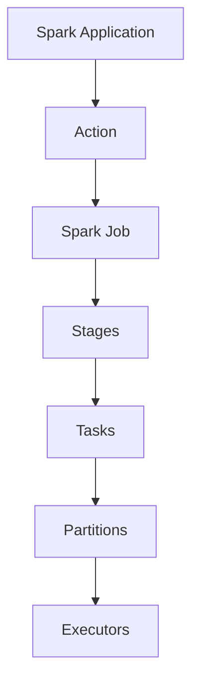

A simpler way to remember the relationship:

```text
Job
 ↓
Stages
 ↓
Tasks
 ↓
Partitions
 ↓
Executors
```

---

# 5. DAG Explanation

DAG stands for **Directed Acyclic Graph**.

Spark creates a DAG from the transformations written in the application.

### DAG Flow

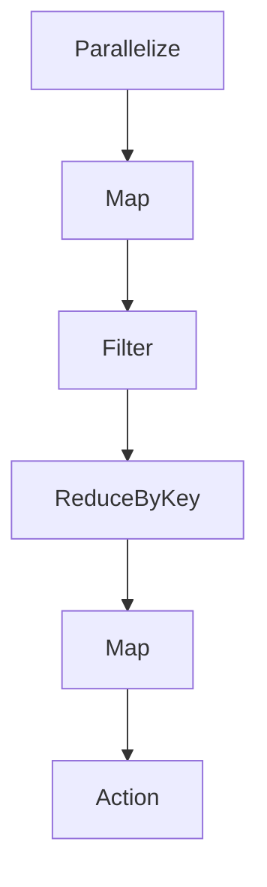

The **DAG Scheduler** analyzes the DAG and divides it into stages.

Shuffle boundaries separate the stages.

The DAG helps Spark determine an efficient execution plan.

---

# 6. Stage Prediction Scenario

Consider the following pipeline:

```text
RDD → map → filter → reduceByKey → map → filter → count
```

### Stage Prediction

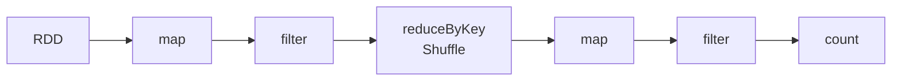

### Stage 1

```text
RDD
 ↓
map
 ↓
filter
```

### Shuffle Boundary

```text
reduceByKey
```

### Stage 2

```text
reduceByKey
 ↓
map
 ↓
filter
 ↓
count
```

### Total Stages

```text
2 Stages
```

### Reason

`map` and `filter` are narrow transformations and can be pipelined in the same stage.

`reduceByKey` is a wide transformation and causes a shuffle.

The shuffle creates the boundary between Stage 1 and Stage 2.

The final `count` action triggers execution.

---

# 7. Actual RDD Lineage

A sales RDD is created with **4 partitions**.

### Sales Data

```text
Laptop    -> 75000
Mouse     -> 1500
Keyboard  -> 3000
Laptop    -> 75000
Monitor   -> 20000
Mouse     -> 1500
```

The data is filtered to keep sales greater than `2000`.

Then the data is mapped and `reduceByKey` is used to calculate total sales for each product.

### Lineage Flow

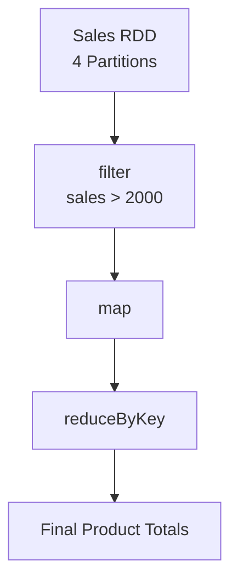

### Filtered Sales

```text
(Laptop,75000)
(Keyboard,3000)
(Laptop,75000)
(Monitor,20000)
```

### Final Product Totals

```text
(Keyboard,3000)
(Laptop,150000)
(Monitor,20000)
```

---

# 8. RDD Lineage Using `toDebugString`

The application uses `toDebugString` to display the actual lineage of the final RDD.

The output contains entries such as:

```text
ShuffledRDD
MapPartitionsRDD
MapPartitionsRDD
ParallelCollectionRDD
```

The presence of `ShuffledRDD` confirms that `reduceByKey` introduced a shuffle.

### Lineage

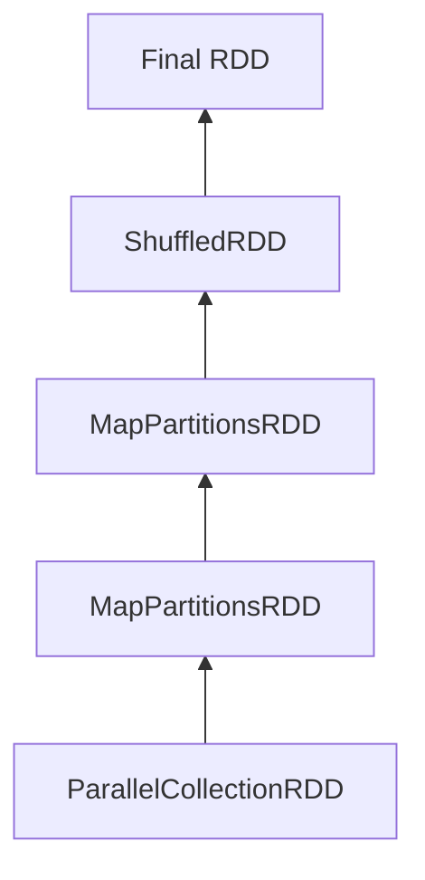

RDD lineage records the sequence of transformations used to create an RDD.

Spark can use lineage information to recompute lost partitions when required.

---

# 9. Partitions and Tasks

The sales input RDD was created with **4 partitions**.

```text
Input RDD
   │
   ├── Partition 1
   ├── Partition 2
   ├── Partition 3
   └── Partition 4
```

### Before Shuffle

Tasks process the input partitions in parallel.

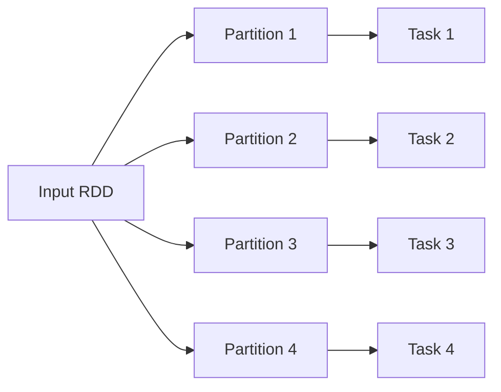

### At `reduceByKey`

Data is shuffled according to keys.

### After Shuffle

New tasks process the shuffled partitions.

This allows Spark to execute different parts of the data in parallel.

---

# 10. Transformations and Actions

## Transformations

Transformations create new RDDs from existing RDDs.

Examples:

* `map`
* `filter`
* `flatMap`
* `reduceByKey`

Transformations are **lazy**.

## Actions

Actions return a result or write data.

Examples:

* `collect`
* `count`
* `first`
* `reduce`
* `take`

Actions trigger Spark job execution.

### Execution Concept

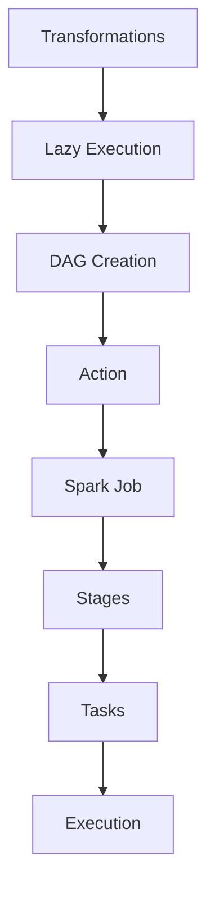

---

# 11. DAG Scheduler

The **DAG Scheduler** is responsible for dividing a Spark job into stages.

It looks at the dependencies between RDDs.

* Narrow dependencies can be executed within the same stage.
* Wide dependencies involving shuffle create stage boundaries.

### Overall Spark Execution

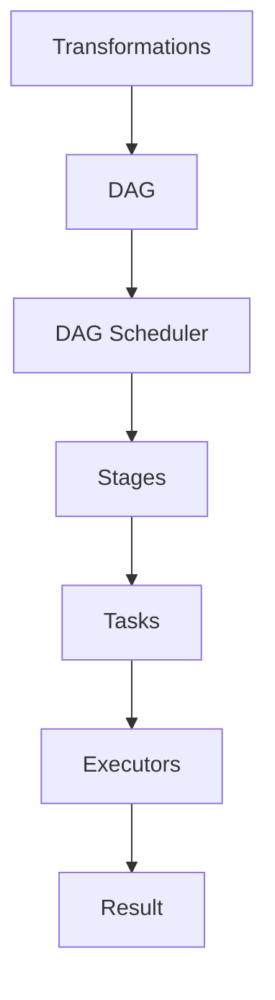

Therefore:

```text
Transformations
       ↓
      DAG
       ↓
DAG Scheduler
       ↓
     Stages
       ↓
     Tasks
       ↓
   Executors
       ↓
    Result
```

---

# 12. Narrow Dependency

In a narrow dependency, each child partition depends on a small number of parent partitions.

Examples:

```text
map
filter
flatMap
```

### Example

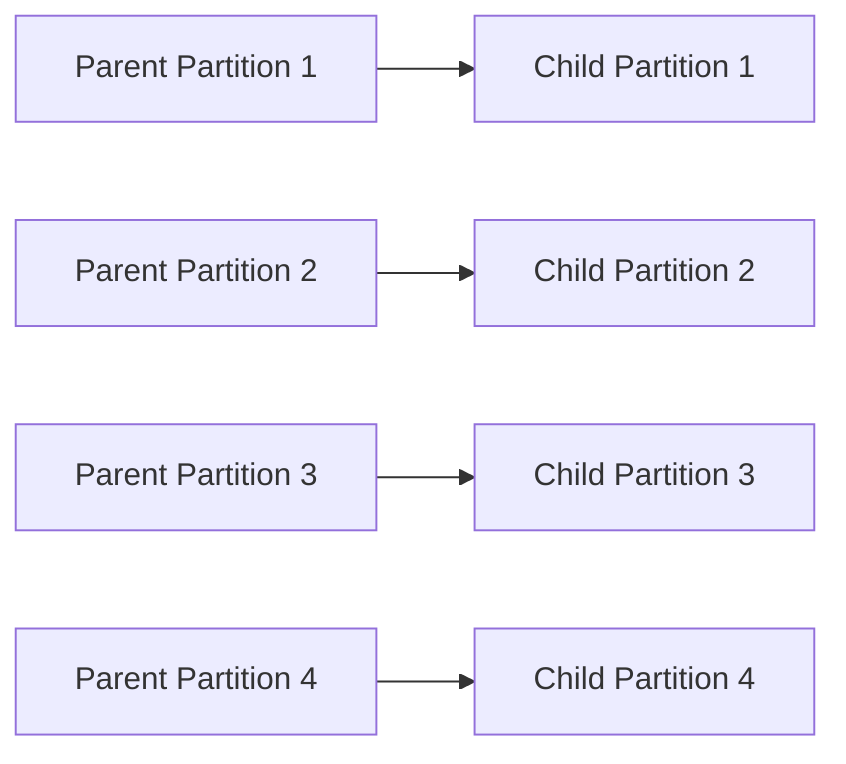

Narrow transformations can usually be pipelined within the same stage.

---

# 13. Wide Dependency

In a wide dependency, a child partition may depend on multiple parent partitions.

Examples:

```text
reduceByKey
groupByKey
join
repartition
```

### Example

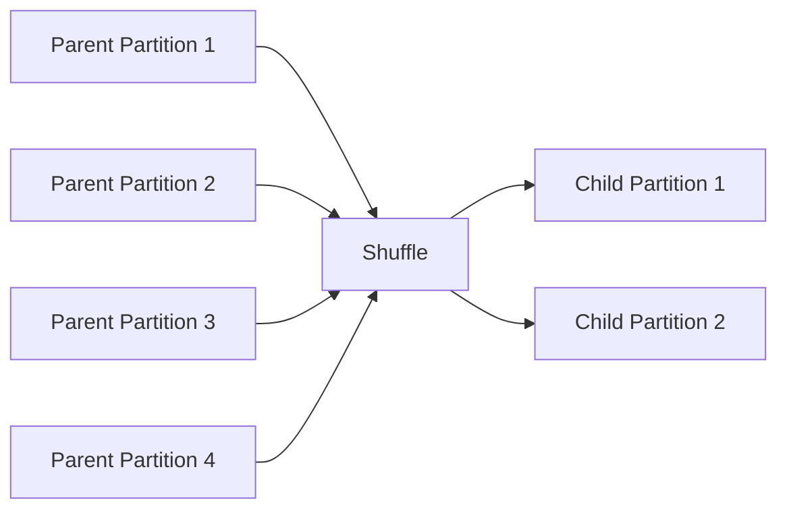

Wide dependencies require data movement between partitions and create shuffle boundaries.

---

# 14. Fault Tolerance and Shuffle Understanding

Shuffle is an expensive operation because data may need to be transferred between partitions.

Spark separates stages at shuffle boundaries so that execution can be organized around these dependencies.

If a partition is lost, Spark can use **RDD lineage** to recompute the required data.

### Fault-Tolerance Concept

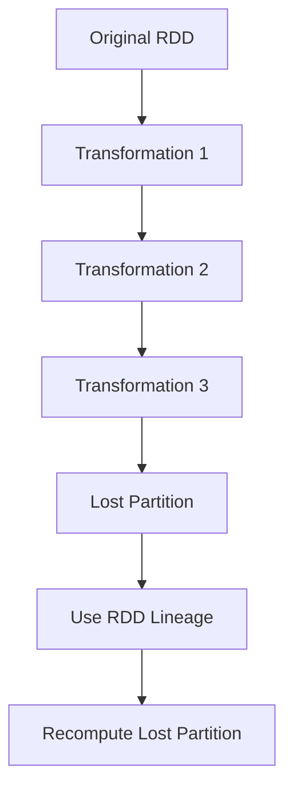

---

# 15. Complete Spark Execution Flow

The complete concept demonstrated in Day 8 can be summarized as:

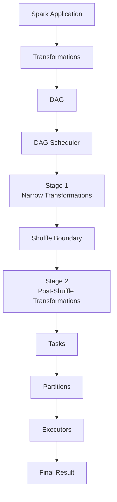

---

# 16. Key Concepts

| Concept               | Description                                         |
| --------------------- | --------------------------------------------------- |
| DAG                   | Directed Acyclic Graph representing the computation |
| Transformation        | Operation that creates a new RDD                    |
| Action                | Operation that triggers execution                   |
| Job                   | Execution triggered by an action                    |
| Stage                 | Set of tasks separated by shuffle boundaries        |
| Task                  | Smallest unit of work sent to an executor           |
| Partition             | Logical chunk of distributed data                   |
| Narrow Transformation | Transformation without data shuffle                 |
| Wide Transformation   | Transformation that requires data redistribution    |
| Shuffle               | Redistribution of data between partitions           |
| Lineage               | Record of transformations used to create an RDD     |
| DAG Scheduler         | Divides a job into stages                           |

---

# 17. Final Summary

1. DAG means **Directed Acyclic Graph**.
2. Transformations are **lazy**.
3. Actions trigger **Spark jobs**.
4. A job is divided into **stages**.
5. Stages are separated by **shuffle boundaries**.
6. Tasks execute the work for partitions.
7. Narrow transformations do not require a shuffle.
8. Wide transformations require a shuffle.
9. `reduceByKey` is a wide transformation.
10. `reduceByKey` creates a shuffle boundary.
11. Spark uses the DAG Scheduler to divide jobs into stages.
12. RDD lineage records the transformations used to create an RDD.
13. Spark can use lineage to recompute lost partitions.
14. Partitions allow parallel processing.

---

# Execution Result

The application executed successfully.

```text
===== DAY 8 DAG AND SPARK EXECUTION COMPLETED =====

[success]
```

The application successfully demonstrated:

* Multiple transformations and actions
* Narrow transformations
* Wide transformations
* Shuffle boundary
* Jobs
* Stages
* Tasks
* Partitions
* DAG
* Stage prediction
* RDD lineage
* `toDebugString`
* `reduceByKey` shuffle
* Parallel processing

---

# Conclusion

This assignment demonstrated how Spark converts transformations into a **DAG** and divides execution into **stages based on shuffle boundaries**.

It also demonstrated the relationship between **jobs, stages, tasks, and partitions**, along with the difference between narrow and wide transformations.

The practical execution of `reduceByKey`, `toDebugString`, partition processing, and stage prediction helped in understanding how Spark internally organizes distributed computation.

```text
===== DAY 8 DAG AND SPARK EXECUTION COMPLETED =====
```
